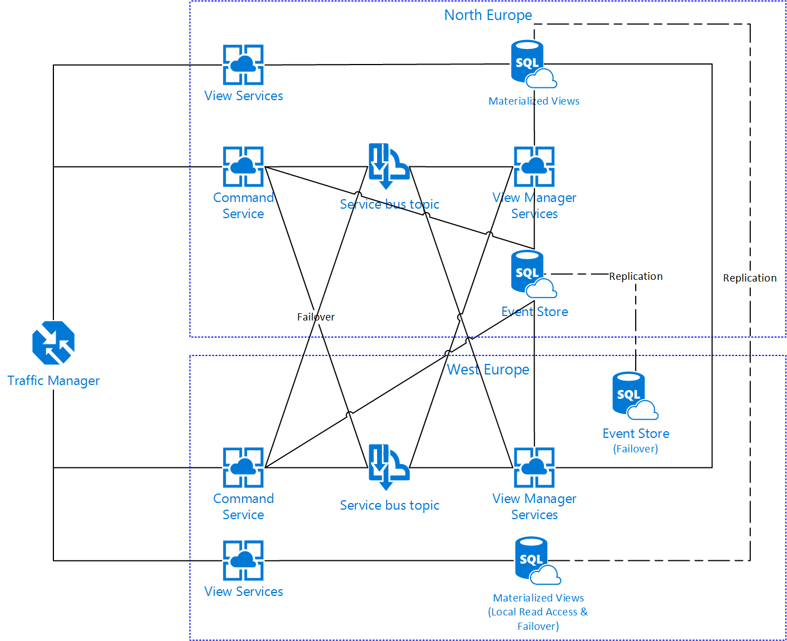

#azure-framework

An experimental framework to demonstrate good practices in using Java on Azure.

This framework uses:
* Domain Driven Design (DDD)
* Command Sourcing
* Event Sourcing
* Event Store (Input and Output Streams)
* Command Query Responsibility Segregation (CQRS)
* Declarative Preconditions
* Eventual Consistency
* Always Valid Objects
* Factory Pattern
* Builder Pattern
* Single Responsibility Principle (SRP)
* Open Closed Principle (OCP)
* Liskov Substituion Principle (LSP)
* Interface Segregation Principle (ISP)
* Dependency Inversion Principle (DIP)
* Reflection
* Spring
* Dependency Injection on Aggregate and Command objects
* JPA
* REST (JAX-RS) using Jackson FasterXML to enable a single handler for all commands

Example Solution Topology

